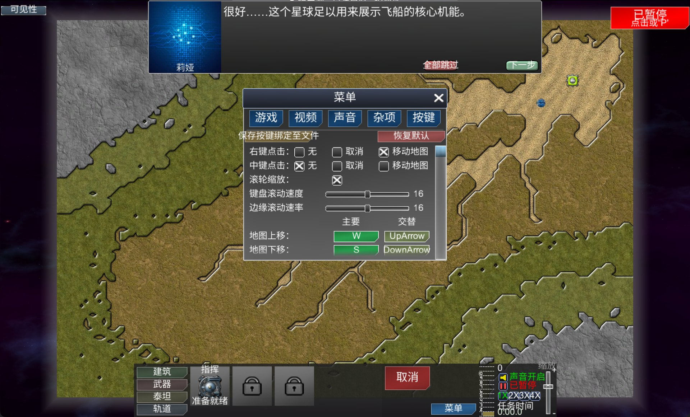

# Creeper World 3 简体中文补丁

面向 **Windows Steam 2.12 / build 22453699**，主要菜单、剧情和教程纯离线汉化。已在 CrossOver 26.2 使用；原生 Windows 未完整实测，不支持原生 Mac 版。社区内容和地图编辑器可能保留英文。

## 下载与安装

从 [Release](https://github.com/m1m0ry/cw3-localization-public/releases/latest) 下载 `CW3-Windows-v12.5.zip`。这是完整覆盖补丁，附安装和恢复入口；GitHub 的源码 ZIP 不是安装包。须自备匹配的正版游戏。

完全退出游戏。已有补丁先用原入口恢复，将旧 `.cw3-zh-backup` 另存到游戏目录外。解压后运行 `安装或恢复.cmd`（Windows）或 `安装或恢复.command`（CrossOver），需要 Python 3.10+，无需其他 Python 包。安装器校验版本与哈希、备份原版；恢复使用同包入口，保留 `.cw3-zh-backup`。

Steam 中右键游戏 → 管理 → 浏览本地文件，定位包含 `CW3.exe` 的目录：

- Windows：`<Steam 库>\steamapps\common\Creeper World 3`
- CrossOver：`~/Library/Application Support/CrossOver/Bottles/<瓶名>/drive_c/Program Files (x86)/Steam/steamapps/common/Creeper World 3`

手工覆盖须先备份 `CW3_Data`，将包内 `CW3_Data` 和 `CW3Localization` 合并到游戏目录，保留其他文件。恢复自己的备份，并删除新增的 `CW3_Data/Managed/CW3Rendering.dll`、`CW3_Data/Managed/CW3Runtime.dll` 及 `CW3Localization` 中的 `zh-CN.json`、`font.ttf`、`OFL.txt`；先另存自改词典和字体。安装和恢复不改存档。

## 译文与构建

译文统一维护在 `translations/zh-CN.json`。仅修改 `translation`，保留原文、目标、标签和占位符；检查无需游戏文件或翻译服务：

```sh
python3 tools/workflow.py check
```

已安装补丁的词典位于 `CW3Localization/zh-CN.json`，退出后替换，重启生效。新增显示位置或字形须重新构建。源码构建需自备匹配游戏文件及构建依赖，见[构建文档](docs/build.md)。

## 游戏截图

中文主菜单。


序幕文字。


莉娅对话与按键设置。



自写代码采用 [MIT](LICENSE)，字体采用 [OFL 1.1](fonts/OFL.txt)。游戏原文、画面及资源不属于本项目的 MIT 授权范围，见 [NOTICE](NOTICE.md)。

[贡献译文](CONTRIBUTING.md) · [构建与安装](docs/build.md) · [字体与第三方许可](docs/licensing.md)
